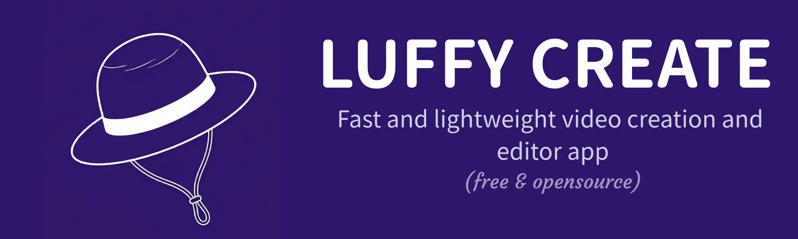
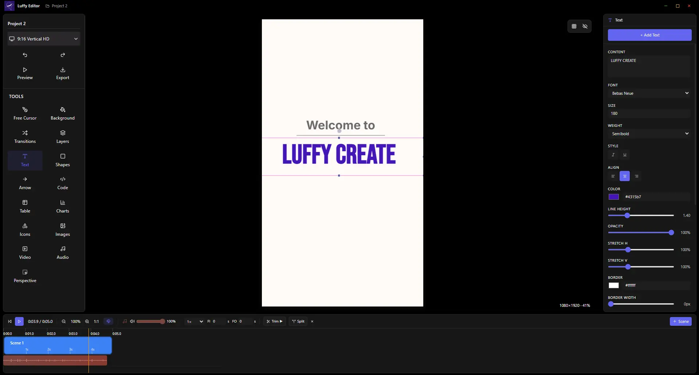

<div align="center">



# Luffy Create

**A free, open-source desktop app for making animated videos for technical and educational content.**

Code walkthroughs, system-design diagrams, and slide-based animations — with frame-accurate timing and direct MP4 export. Fully offline, no account required.

[](https://github.com/Creatorsai-Lab/luffy-editor/releases/latest)
[](LICENSE)
[](https://github.com/Creatorsai-Lab/luffy-editor/releases/latest)

[🌏︎ Website](https://creatorsai-lab.github.io/luffy-editor/) · [⇊ Download](https://github.com/Creatorsai-Lab/luffy-editor/releases/latest) · [ 🖿 User GUIDE](https://github.com/Creatorsai-Lab/luffy-editor)
</div>

---

## Features

- **Scene-based editor** with a frame-accurate timeline and playback preview
- **Rich elements** — text, shapes, arrows, syntax-highlighted code blocks, images, video, audio, charts, tables, and icons
- **Animations** — enter / loop / exit effects with full easing control; typewriter, draw-path, flow, and more
- **Image & video adjustments** — brightness, contrast, exposure, highlights, shadows, temperature, tint, vibrance, blur, crop, and perspective warp
- **Scene transitions** — fade, slide, push, zoom, wipe, morph
- **Export** — MP4 video (720p / 1080p) and PNG / WebP stills, rendered locally with FFmpeg
- **Offline-first** — everything runs on your machine; no sign-up, no cloud, no telemetry

---

<div align="center">



<sub>The Luffy Create editor — tools on the left, canvas in the center, properties on the right, timeline below.</sub>

</div>

---

## Download & Install

### Windows

1. Download the latest `Luffy_Create_Installer_v1.exe` from the [**Releases page**](https://github.com/Creatorsai-Lab/luffy-editor/releases/latest).
2. Run the installer. Windows SmartScreen may show an *"Unknown publisher"* warning — click **More info → Run anyway**. The app is unsigned for now and completely safe (source is public, build it yourself if you prefer).
3. Launch **Luffy Create** from the Start Menu.

### macOS & Linux

Not yet packaged. You can run from source (see below) on any platform. Native builds are planned.

---

## Quick Start

1. **New project** → pick a canvas size (16:9, 9:16, square, etc.)
2. **Add a background** from the Background tool
3. **Add elements** — text, shapes, code, images, video from the left sidebar
4. **Animate** — select an element and add an enter / loop / exit animation
5. **Preview** with the timeline play button
6. **Export** → choose MP4 or an image format → Save

Full walkthrough in the [**User Guide**](docs/index.md).

---

## Build from Source

Requires [Node.js](https://nodejs.org) 18+ and npm.

```bash
# Clone
git clone https://github.com/Creatorsai-Lab/luffy-editor.git
cd luffy-editor

# Install dependencies
npm install

# Run in development
npm run dev

# Build a production installer (output in dist/)
npm run package
```

The packaged installer for your current OS lands in `dist/`.

---

## Tech Stack

| Layer | Technology |
|---|---|
| Shell | [Electron](https://www.electronjs.org/) |
| UI | [React](https://react.dev/) + [TypeScript](https://www.typescriptlang.org/) |
| Canvas | [Konva](https://konvajs.org/) / react-konva |
| State | [Zustand](https://github.com/pmndrs/zustand) + [Immer](https://immerjs.github.io/immer/) |
| Styling | [Tailwind CSS](https://tailwindcss.com/) |
| Build | [electron-vite](https://electron-vite.org/) + [electron-builder](https://www.electron.build/) |
| Video export | [FFmpeg (WASM)](https://ffmpegwasm.netlify.app/) |
| Code editor | [Monaco](https://microsoft.github.io/monaco-editor/) |

---

## Documentation

| Guide | Covers |
|---|---|
| [Overview](docs/index.md) | Interface tour, projects, scenes, quick start |
| [Elements](docs/elements.md) | Every element type and its properties |
| [Animations](docs/animations.md) | Timing, easing, all animation types |
| [Adjustments](docs/adjustments.md) | Filters, crop, perspective warp |
| [Export](docs/export.md) | MP4 / PNG / WebP export workflow |
| [Shortcuts](docs/shortcuts.md) | Keyboard reference |

---

## Contributing

Issues and pull requests are welcome. For bugs, please include your OS, steps to reproduce, and screenshots if relevant.

---

## License

Released under the [MIT License](LICENSE).
